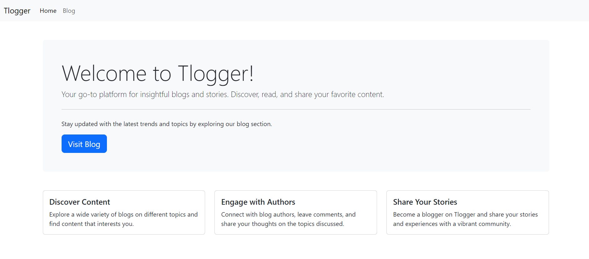

# Tlogger

Tlogger is a blog website built using HTML, CSS, JavaScript, Express.js, and Handlebars. It provides a platform for users to view blog posts.



## Tech Stack

- **Frontend**: HTML, CSS, JavaScript
- **Backend**: Express.js
- **Templating Engine**: Handlebars

## Features

- View a list of all blog posts
- User-friendly interface

## Installation

1. Clone the repository:

2. Install the dependencies:
    ```bash
    npm install
    ```

## Running the Application

1. Start the application using nodemon:
    ```bash
    nodemon index.js
    ```

2. Open your browser and navigate to `http://localhost:3000` to see the blog website in action.

## Contributing

Contributions are welcome! Please fork the repository and create a pull request with your changes.

## License
